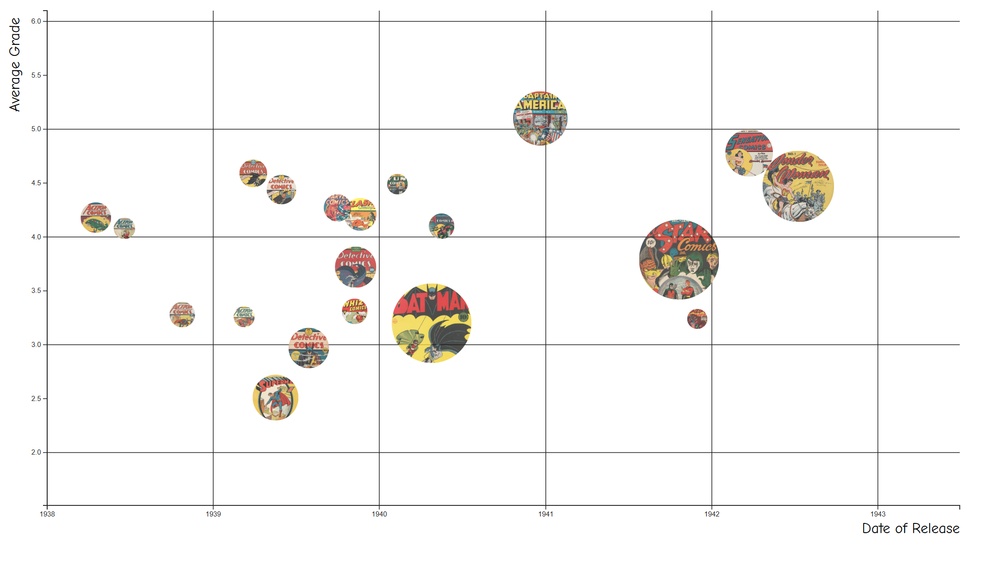

# cgc-census-data-visualization

[See it in action](https://roblarsen.org/cgc-census-data-visualization/)

      
This repo contains code to run a bubble chart visualization of certain CGC census data.
This initial version looks at the average grade and total population of the top ten
Golden Age books in order to compare the relative difficulty of acquiring the books.

- The X axis is time, with the idea that as superheroes became more popular, maybe there would be a larger population of books
- The Y axis is the average grade
- The third factor, represented by the size of the circles, is the number of unrestored copies in the CGC census.

The project is written in TypeSCript and leverage D3.
